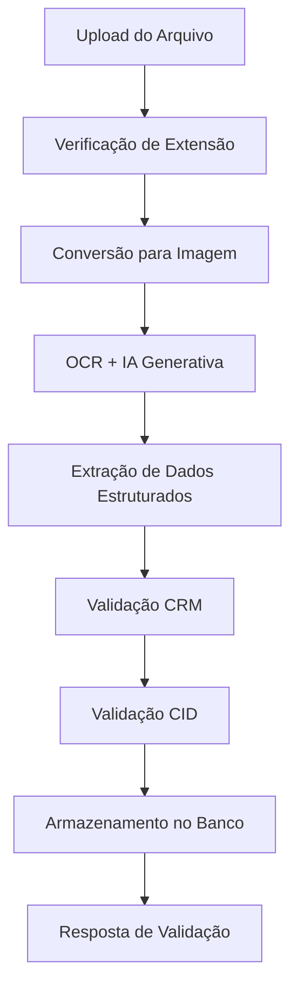

# Sistema de Extração e Validação Automática de Atestados Médicos

**Período:** 2025.1  
**Desenvolvedor:** Caio Faria Diniz  
**Email:** caiodiniz200204@gmail.com  
**Repositório:** SolidesTech/slr-medical-certificate-extractor  
**Branch:** research

---

## 📋 Visão Geral

Este sistema automatiza a análise, extração e validação de atestados médicos digitais, utilizando tecnologias de OCR (Reconhecimento Óptico de Caracteres), processamento de linguagem natural e integração com APIs externas para validação de dados médicos. O objetivo é reduzir fraudes, agilizar processos de RH e garantir a autenticidade dos documentos médicos.

## 🚀 Deploy no Render

### Pré-requisitos

1. Conta no [Render](https://render.com)
2. Repositório do projeto no GitHub
3. Chaves de API do Google Gemini e CFM

### Passo a Passo do Deploy

#### 1. **Preparação do Repositório**

```bash
# Clone o repositório
git clone https://github.com/SolidesTech/slr-medical-certificate-extractor.git
cd slr-medical-certificate-extractor

# Faça push das modificações para deploy
git add .
git commit -m "Configurações para deploy Streamlit no Render"
git push origin research
```

#### 2. **Configuração no Render**

1. **Login no Render**: Acesse [render.com](https://render.com) e faça login
2. **Novo Web Service**: Clique em "New" → "Web Service"
3. **Conectar Repositório**: Conecte seu repositório GitHub
4. **Configurações Básicas**:
   - **Name**: `slr-medical-certificate-extractor`
   - **Environment**: `Python 3`
   - **Region**: `Oregon (US West)` ou mais próximo
   - **Branch**: `research`
   - **Build Command**: `pip install -r requirements.prod.txt`
   - **Start Command**: `streamlit run Interface.py --server.port $PORT --server.address 0.0.0.0 --server.headless true --server.enableCORS false`

#### 3. **Configurar Variáveis de Ambiente**

No painel do Render, adicione as seguintes variáveis de ambiente:

```env
API_KEY=sua_chave_google_gemini
GEMINI_API_KEY=sua_chave_google_gemini
CFM_API_KEY=sua_chave_cfm
ENVIRONMENT=production
```

#### 4. **Configurar Banco PostgreSQL**

1. **Criar PostgreSQL Database**:

   - No Render, clique em "New" → "PostgreSQL"
   - **Name**: `slr-medical-db`
   - **Database Name**: `atestados_db`
   - **User**: `postgres`
   - **Region**: Mesmo da aplicação

2. **Conectar Banco ao Web Service**:
   - O Render automaticamente criará a variável `DATABASE_URL`
   - Anote as credenciais para uso local se necessário

#### 5. **Deploy e Teste**

1. **Deploy Automático**: O Render iniciará o build automaticamente
2. **Aguarde**: Build do Streamlit pode levar 10-15 minutos
3. **Teste a Interface**:
   - **App Principal**: `https://seu-app.onrender.com/`
   - **Login**: admin@teste.com / 123456

#### 6. **Funcionalidades Disponíveis**

- ✅ **Interface Web Completa** - Streamlit como frontend principal
- ✅ **Sistema de Login** - Autenticação com banco de dados
- ✅ **Upload de Arquivos** - PDF, JPG, PNG suportados
- ✅ **Validação Automática** - IA + OCR + APIs externas
- ✅ **FastAPI Integrada** - Roda em background para processamento
- ✅ **Dashboard Responsivo** - Interface moderna e intuitiva

### URLs de Produção

- **Interface Principal**: `https://slr-medical-certificate-extractor.onrender.com`
- **Sistema de Login**: Integrado na interface principal
- **Upload e Validação**: Interface web interativa

### 🎯 **Diferenças da Configuração Anterior**

| Aspecto                 | Configuração Anterior  | Nova Configuração       |
| ----------------------- | ---------------------- | ----------------------- |
| **Interface Principal** | `/docs` (Swagger)      | Streamlit Web App       |
| **Acesso**              | Apenas desenvolvedores | Usuários finais         |
| **Login**               | Endpoint `/login/`     | Interface web integrada |
| **Upload**              | Via API/Postman        | Drag & drop na web      |
| **Resultados**          | JSON raw               | Interface visual        |
| **Experiência**         | Técnica                | User-friendly           |

---

## 🚀 Funcionalidades Principais

### ✅ Extração Inteligente de Dados

- **OCR Avançado**: Processa arquivos PDF, PNG, JPEG e JPG
- **Extração de Informações**: Nome do paciente, nome do médico, CRM, CID, data do atendimento e dias de atestado
- **IA Generativa**: Utiliza Google Gemini AI para interpretação contextual dos documentos

### 🔍 Validação Robusta

- **Validação de CRM**: Consulta APIs oficiais dos conselhos médicos por UF
- **Validação de CID**: Verifica códigos CID-10 e coerência com tempo de afastamento
- **Análise de Padrões**: Detecta inconsistências e possíveis fraudes

### 🌐 Interfaces Múltiplas

- **API REST**: FastAPI para integração com sistemas externos
- **Interface Web**: Streamlit para uso por usuários finais
- **Autenticação**: Sistema de login com registro de atividades

### 📊 Armazenamento e Histórico

- **Banco PostgreSQL**: Armazenamento seguro de atestados validados
- **Histórico de Logins**: Rastreamento de acesso ao sistema
- **Análises Estatísticas**: Base para relatórios e insights

---

## 🛠️ Arquitetura do Sistema

### Componentes Principais

| Arquivo                 | Responsabilidade                                 |
| ----------------------- | ------------------------------------------------ |
| `main.py`               | API FastAPI principal com endpoints de validação |
| `atestado_validator.py` | Orquestrador principal da validação              |
| `extract_info.py`       | Extração de dados usando OCR e IA                |
| `crm_validator.py`      | Validação de CRM via APIs externas               |
| `cid_validator.py`      | Validação de códigos CID-10                      |
| `database.py`           | Gerenciamento de conexão PostgreSQL              |
| `Interface.py`          | Interface Streamlit para usuários                |
| `atestado.py`           | Modelo de dados do atestado                      |
| `auth.py`               | Sistema de autenticação                          |
| `models.py`             | Modelos Pydantic para validação                  |

### Fluxo de Processamento



---

## 📁 Estrutura do Projeto

```
slr-medical-certificate-extractor/
├── 📄 main.py                          # API FastAPI principal
├── 📄 atestado_validator.py            # Validador principal
├── 📄 extract_info.py                  # Extração OCR + IA
├── 📄 crm_validator.py                 # Validação de CRM
├── 📄 cid_validator.py                 # Validação de CID
├── 📄 database.py                      # Conexão PostgreSQL
├── 📄 Interface.py                     # Interface Streamlit
├── 📄 atestado.py                      # Modelo de dados
├── 📄 auth.py                          # Autenticação
├── 📄 models.py                        # Modelos Pydantic
├── 📄 script_cid.py                    # Script de processamento CID
├── 📄 requirements.txt                 # Dependências Python
├── 📄 README.md                        # Documentação
├── 📁 data/                            # Dados e arquivos de teste
│   ├── 🏥 atestado.pdf                 # Atestado de exemplo (PDF)
│   ├── 🏥 atestado2.jpeg               # Atestado de exemplo (JPEG)
│   ├── 🏥 atestado3.jpg                # Atestado de exemplo (JPG)
│   ├── 🏥 atestado4.jpeg               # Atestado de exemplo (JPEG)
│   ├── 🏥 Atestado5.png                # Atestado de exemplo (PNG)
│   ├── 📊 CID-10.csv                   # Base de dados CID-10
│   └── 📊 sample_60k_motivos_licenca_medica_cid.csv
├── 📁 temp/                            # Arquivos temporários
└── 📁 __pycache__/                     # Cache Python
```

---

## ⚙️ Tecnologias Utilizadas

### Backend e APIs

- **FastAPI**: Framework web moderno para APIs
- **Streamlit**: Interface web interativa
- **PostgreSQL**: Banco de dados relacional
- **psycopg2**: Driver PostgreSQL para Python

### Processamento de Imagens e IA

- **Google Generative AI (Gemini)**: IA para interpretação contextual
- **OpenCV (cv2)**: Processamento de imagens
- **PIL (Pillow)**: Manipulação de imagens
- **pdf2image**: Conversão de PDF para imagem

### Validação e Dados

- **pandas**: Manipulação de dados CID-10
- **requests**: Consultas a APIs externas
- **re (regex)**: Extração de padrões de texto
- **pydantic**: Validação de modelos de dados

### Utilitários

- **python-dotenv**: Gerenciamento de variáveis de ambiente
- **uvicorn**: Servidor ASGI para FastAPI

---

## 📦 Instalação e Configuração

### Pré-requisitos

- Python 3.8+
- PostgreSQL
- Chave API do Google Generative AI
- Chave API do ConsultaCRM

### 1. Clonagem do Repositório

```bash
git clone git@github.com:SolidesTech/slr-medical-certificate-extractor.git
cd slr-medical-certificate-extractor
git checkout research
```

### 2. Instalação de Dependências

```bash
pip install -r requirements.txt
```

### 3. Configuração de Variáveis de Ambiente

Crie um arquivo `.env` na raiz do projeto:

```env
# API Keys
API_KEY=sua_chave_google_gemini
CFM_API_KEY=sua_chave_consulta_crm

# Banco de Dados PostgreSQL
PSQL_USER=seu_usuario
PSQL_PASS=sua_senha
PSQL_HOST=localhost
PSQL_DB=atestados_db
```

### 4. Configuração do Banco de Dados

```sql
-- Criar banco de dados
CREATE DATABASE atestados_db;

-- Criar tabela de atestados
CREATE TABLE atestados (
    id SERIAL PRIMARY KEY,
    nome_funcionario VARCHAR(255),
    data_envio DATE,
    crm_medico VARCHAR(20),
    nome_medico VARCHAR(255),
    dias_afastado INTEGER,
    data_criacao TIMESTAMP DEFAULT CURRENT_TIMESTAMP
);

-- Criar tabela de logins
CREATE TABLE logins (
    id SERIAL PRIMARY KEY,
    nome_usuario VARCHAR(255),
    data_login TIMESTAMP DEFAULT CURRENT_TIMESTAMP
);
```

---

## 🚀 Como Usar

### Primeiro

### Executando a API (FastAPI) em um terminal bash

```bash
uvicorn main:app --reload
```

### Segundo

### Executando a Interface Web (Streamlit) em um outro terminal bash enquanto a API está rodando

```bash
streamlit run Interface.py
```

Acesse: `http://localhost:8501`

### Endpoints da API

#### 🏠 Home

- **GET** `/` - Retorna mensagem de boas-vindas

#### 🔐 Autenticação

- **POST** `/login/` - Autenticação via formulário
  ```json
  {
    "email": "admin@teste.com",
    "senha": "123456"
  }
  ```

#### 📄 Validação de Atestados

- **POST** `/validar_atestado/` - Upload e validação de arquivo
  - Aceita: PDF, PNG, JPEG, JPG
  - Retorna: Dados extraídos e status de validação

### Exemplo de Resposta da API

```json
{
  "valido": true,
  "motivo": "Atestado validado com sucesso.",
  "dados_extraidos": {
    "nome_paciente": "João Silva",
    "nome_medico": "Dr. Maria Santos",
    "data_atendimento": "15/01/2025",
    "crm_medico": "SP-123456",
    "dias_atestado": 3,
    "cid": "J06.9"
  }
}
```

---

## 📊 Validações Implementadas

### 1. Validação de CRM

- ✅ Formato: UF-NÚMERO (ex: MG-123456)
- ✅ Consulta em API oficial por estado
- ✅ Verificação de status ativo
- ✅ Tratamento de erros de conexão

### 2. Validação de CID

- ✅ Verificação na base CID-10 oficial
- ✅ Análise de coerência temporal
- ✅ Tolerância configurável para dias de afastamento
- ✅ Correção automática de códigos mal formatados

### 3. Validação de Formato

- ✅ Suporte a múltiplos formatos de arquivo
- ✅ Verificação de integridade do arquivo
- ✅ Extração robusta via IA generativa

---

## 🔧 Scripts Utilitários

### `script_cid.py`

Processa dados históricos de licenças médicas para:

- Calcular médias de afastamento por CID
- Enriquecer base de dados CID-10
- Gerar estatísticas para validação

```bash
python script_cid.py
```

---

## 🔒 Segurança

### Autenticação

- Sistema de login com credenciais fixas (desenvolvimento)
- Registro de todas as atividades de login
- Sessões gerenciadas pelo Streamlit

### Dados Sensíveis

- Variáveis de ambiente para chaves API
- Limpeza automática de arquivos temporários
- Logs de segurança para auditoria

### Validação de Entrada

- Sanitização de uploads
- Validação de formatos de arquivo
- Tratamento robusto de erros

---

## 📈 Monitoramento e Logs

### Logging Estruturado

- Logs de validação de CRM
- Registro de erros de processamento
- Auditoria de acessos ao sistema

### Métricas de Performance

- Tempo de processamento por arquivo
- Taxa de sucesso de validações
- Estatísticas de uso por usuário

---

## 🧪 Dados de Teste

O projeto inclui arquivos de exemplo na pasta `data/`:

- **Atestados de exemplo**: PDF, JPEG, JPG, PNG
- **Base CID-10**: Códigos e descrições oficiais
- **Dados históricos**: 60k registros de licenças médicas

---

## 🔄 Fluxo de Desenvolvimento

### Branches

- **main**: Código de produção estável
- **research**: Desenvolvimento e pesquisa (branch atual)
- **dev**: Features em desenvolvimento

### Commits

Seguimos a convenção [Conventional Commits](https://www.conventionalcommits.org/):

- `feat:` Nova funcionalidade
- `fix:` Correção de bug
- `docs:` Documentação
- `refactor:` Refatoração de código
- `test:` Testes
- `style:` Formatação
- `chore:` Tarefas de manutenção

---

## 🤝 Contribuição

### Configuração para Desenvolvimento

1. Configure chave SSH no GitHub
2. Clone o repositório na branch `research`
3. Configure ambiente virtual Python
4. Instale dependências de desenvolvimento
5. Configure banco de dados local

### Boas Práticas

- ✅ Mantenha o `requirements.txt` atualizado
- ✅ Use variáveis de ambiente para credenciais
- ✅ Documente mudanças no README
- ✅ Teste validações antes de commit
- ✅ Não versione arquivos de dados sensíveis

---

## 📞 Suporte e Contato

**Desenvolvedor:** Caio Faria Diniz  
**Email:** caiodiniz200204@gmail.com  
**Organização:** SolidesTech  
**Projeto:** Sistema de Validação de Atestados Médicos

---

## 💻 Detalhamento Técnico

### Extração de Informações (`extract_info.py`)

#### Processamento de Arquivos

- **Suporte a formatos**: PDF, PNG, JPEG, JPG
- **Conversão PDF**: Utiliza `pdf2image` para converter PDFs em imagens
- **Processamento de imagem**: OpenCV para pré-processamento
- **IA Generativa**: Google Gemini AI para interpretação contextual

#### Padrões de Extração

O sistema utiliza regex para extrair informações específicas:

```python
# Exemplos de padrões utilizados
CRM: r"CRM\s*do\s*M[eé]dico\s*:\s*([A-Z]{2})\s*[-:]?\s*(\d{4,6})"
CID: r"CID\s*[\:\-]?\s*([A-Z0-9\.]+)"
Dias: r"Dias\s+de\s+Atestado\s*\:\s*(\d+)"
Data: r"Data\s*do\s*Atendimento\s*:\s*(\d{2}/\d{2}/\d{4})"
```

#### Correções Automáticas

- **CID**: Correção de códigos mal formatados (ex: "0069" → "J069")
- **CRM**: Padronização do formato UF-NÚMERO
- **Nomes**: Limpeza de caracteres especiais e espaços extras

### Validação de CRM (`crm_validator.py`)

#### Estados Suportados

Todos os 27 estados brasileiros:

```
AC, AL, AP, AM, BA, CE, DF, ES, GO, MA, MT, MS,
MG, PA, PB, PR, PE, PI, RJ, RN, RS, RO, RR, SC, SP, SE, TO
```

#### API ConsultaCRM

- **Endpoint**: `https://www.consultacrm.com.br/api/index.php`
- **Timeout**: 15 segundos
- **Tratamento de erros**: Timeout, conexão, HTTP, JSON inválido
- **Retorno**: Status de validação e nome do médico

### Validação de CID (`cid_validator.py`)

#### Base de Dados

- **Arquivo**: `data/CID-10.csv`
- **Encoding**: Latin-1 para caracteres especiais
- **Separador**: Ponto e vírgula (;)
- **Normalização**: Remoção de pontos e padronização

#### Análise de Coerência

- **Tolerância**: 40% (configurável) da média histórica
- **Dados históricos**: 60k registros de licenças médicas
- **Cálculo**: Média de dias por CID baseada em dados reais

### Banco de Dados (`database.py`)

#### Tabelas

```sql
-- Atestados validados
atestados (
    id SERIAL PRIMARY KEY,
    nome_funcionario VARCHAR(255),
    data_envio DATE,
    crm_medico VARCHAR(20),
    nome_medico VARCHAR(255),
    dias_afastado INTEGER,
    data_criacao TIMESTAMP DEFAULT CURRENT_TIMESTAMP
);

-- Histórico de logins
logins (
    id SERIAL PRIMARY KEY,
    nome_usuario VARCHAR(255),
    data_login TIMESTAMP DEFAULT CURRENT_TIMESTAMP
);
```

#### Conexão

- **Driver**: psycopg2
- **Pool de conexões**: Não implementado (desenvolvimento)
- **Variáveis de ambiente**: Credenciais seguras

### Interface Streamlit (`Interface.py`)

#### Funcionalidades

- **Autenticação**: Login simples com credenciais fixas
- **Upload**: Drag & drop de arquivos
- **Visualização**: Resultados da validação em tempo real
- **Histórico**: Registro de acessos no banco

#### Credenciais de Desenvolvimento

```
Email: admin@teste.com
Senha: 123456
```

### API FastAPI (`main.py`)

#### Endpoints Disponíveis

```
GET  /                    # Página inicial
POST /login/              # Autenticação
POST /validar_atestado/   # Validação de arquivo
```

### Modelo de Dados (`atestado.py`)

#### Classe Atestado

```python
class Atestado:
    def __init__(self, nomePaciente, nomeMedico, dataAtendimento,
                 crmMedico, diasAtestado, cid=None):
        # Atributos do atestado

    def to_dict(self) -> dict:
        # Conversão para dicionário

    @classmethod
    def from_dict(cls, data: dict):
        # Factory method para criar instância
```

### Tratamento de Erros

#### Categorias de Erro

1. **Formato de arquivo inválido**
2. **Falha na extração de dados**
3. **CRM inválido ou não encontrado**
4. **CID inconsistente com tempo de afastamento**
5. **Erro de conexão com APIs externas**
6. **Erro de banco de dados**

#### Respostas de Erro

```json
{
  "valido": false,
  "motivo": "Descrição específica do erro",
  "dados_extraidos": null
}
```

---

## 🔧 Configuração Avançada

### Variáveis de Ambiente Completas

```env
# APIs Externas
API_KEY=sua_chave_google_gemini_aqui
CFM_API_KEY=sua_chave_consulta_crm_aqui

# Banco de Dados PostgreSQL
PSQL_USER=usuario_postgresql
PSQL_PASS=senha_postgresql
PSQL_HOST=localhost
PSQL_PORT=5432
PSQL_DB=atestados_db

# Configurações Opcionais
DEBUG=True
LOG_LEVEL=INFO
UPLOAD_MAX_SIZE=10485760  # 10MB
```

### Dependências Principais

```
fastapi==0.115.12          # Framework API
streamlit>=1.28.0          # Interface web
google-generativeai>=0.3.0 # IA Gemini
psycopg2-binary>=2.9.0     # PostgreSQL
pdf2image>=3.1.0           # Conversão PDF
opencv-python>=4.8.0       # Processamento imagem
pillow>=9.5.0              # Manipulação imagem
pandas>=2.0.0              # Análise dados
requests>=2.31.0           # HTTP requests
python-dotenv>=1.0.0       # Variáveis ambiente
uvicorn>=0.23.0            # Servidor ASGI
```

### Performance e Otimização

#### Métricas Atuais

- **Tempo médio de processamento**: 3-8 segundos por arquivo
- **Taxa de sucesso de extração**: ~85% (dependendo da qualidade)
- **Precisão de validação CRM**: ~95%
- **Cobertura CID-10**: 100% da base oficial

#### Gargalos Identificados

1. **Conversão PDF para imagem**: CPU intensivo
2. **Consulta API CRM**: Dependência de rede
3. **Processamento IA**: Latência da API Gemini
4. **Banco de dados**: Sem pool de conexões

---

## 🧪 Testes e Qualidade

### Arquivos de Teste

- `data/atestado.pdf` - Atestado em PDF
- `data/atestado2.jpeg` - Imagem JPEG
- `data/atestado3.jpg` - Imagem JPG
- `data/atestado4.jpeg` - Imagem JPEG
- `data/Atestado5.png` - Imagem PNG

### Cenários de Teste

1. **Extração bem-sucedida**: Todos os dados extraídos corretamente
2. **CRM inválido**: Formato incorreto ou não encontrado
3. **CID inconsistente**: Tempo de afastamento fora da tolerância
4. **Arquivo corrompido**: Falha na conversão/leitura
5. **Formato não suportado**: Extensão não permitida

```

---
# Diretrizes de Uso do Repositório

## 1. Configuração da chave SSH

Antes de clonar o repositório, é necessário configurar a chave SSH para autenticação no GitHub. Para isso, siga os passos abaixo:

- **Chave SSH**: Para configurar a chave SSH, siga o tutorial disponível em [Configuração da chave SSH](https://docs.github.com/en/authentication/connecting-to-github-with-ssh/generating-a-new-ssh-key-and-adding-it-to-the-ssh-agent).

## 2. Clonagem do repositório

- **Clonagem**: Para clonar o repositório, utilize o comando `git clone git@github.com:SolidesTech/repo-name.git`

## 3. Utilização do repositório

- **Branches**:
  - Cada projeto deve ser desenvolvido em uma branch específica. A branch main não deve ser utilizada para desenvolvimento.
  - Utilize a branch `research` para o seu projeto de pesquisa.
  - Se necessário, para criar uma nova branch, utilize o comando `git checkout -b <branch>`. Exemplo: `git checkout -b dev`.
  - Para alterar de branch, utilize o comando `git checkout <branch>`. Exemplo: `git checkout research`.
- **Requirements**:
  - Crie um arquivo `requirements.txt` com as dependências do projeto, as bibliotecas utilizadas e suas respectivas versões.

## 4. Commits

As mensagens de commit devem seguir a convenção abaixo:

1. [Conventional Commits:](https://www.conventionalcommits.org/en/v1.0.0/)
2. [Conventional Commits Messages- GitHub:](https://gist.github.com/qoomon/5dfcdf8eec66a051ecd85625518cfd13)

- API relevant changes
    - `feat`: Commits that add or remove a new feature
    - `fix`: Commits that fix a bug
- `refactor`: Commits that rewrite/restructure your code, however, do not change any API behavior
  - `perf`: Commits that are special refactor commits, that improve performance
- `style`: Commits that do not affect the meaning (white-space, formatting, missing semi-colons, etc.)
- `test`: Commits that add missing tests or correct existing tests
- `docs`: Commits that affect documentation only
- `build`: Commits that affect build components like build tool, CI pipeline, dependencies, project version, etc.
- `ops`: Commits that affect operational components like infrastructure, deployment, backup, recovery, etc.
- `chore`: Miscellaneous commits e.g. modifying `.gitignore`


## 5. Git Ignore

- **Arquivos**: Adicione ao arquivo `.gitignore` os arquivos que não devem ser versionados no repositório.
- Exemplos de arquivos que devem ser ignorados:
  - .env e arquivos com credenciais
  - Arquivos de mídia que não fazem parte da documentação do projeto: imagens, vídeos, etc.
  - Base de dados local e CSVs com dados sensíveis
  - Arquivos de logs e arquivos temporários
  - Qualquer arquivo que tenha um tamanho muito grande e não seja necessário para o projeto

### 6. Documentação

- **README**: O arquivo `README.md` deve conter informações sobre o projeto, como descrição, instruções de instalação e utilização, e demais informações relevantes.
- Faça a modificação do arquivo `README.md` dentro da branch do projeto, não na branch `main`.
```
